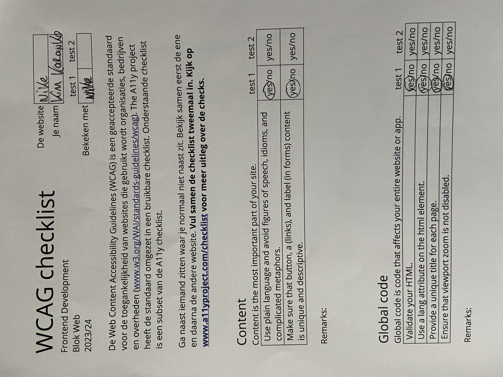
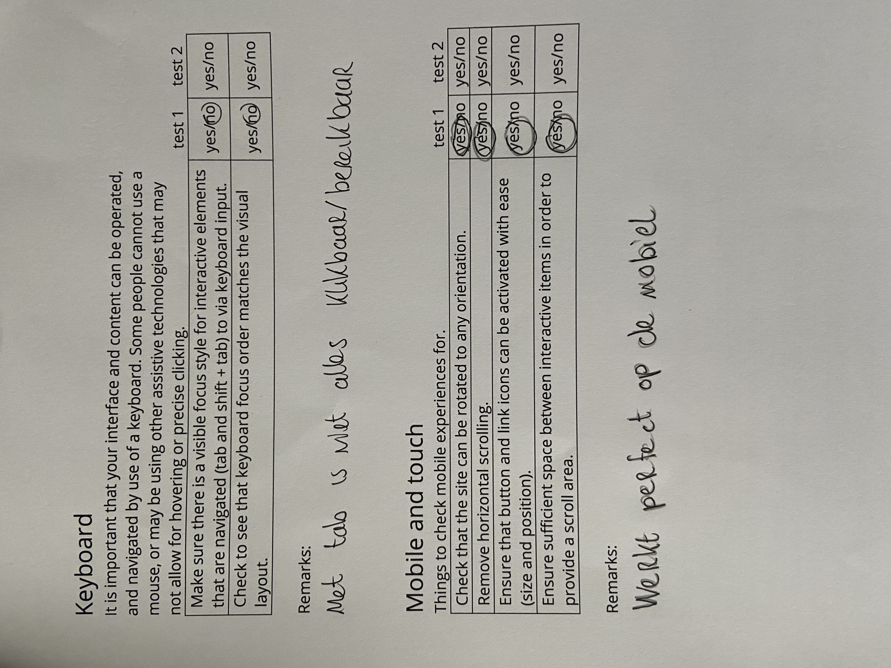
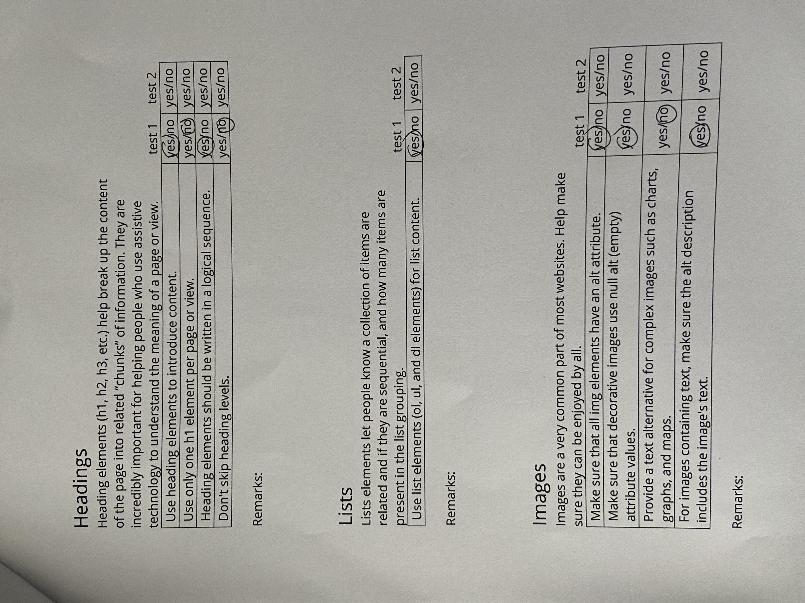
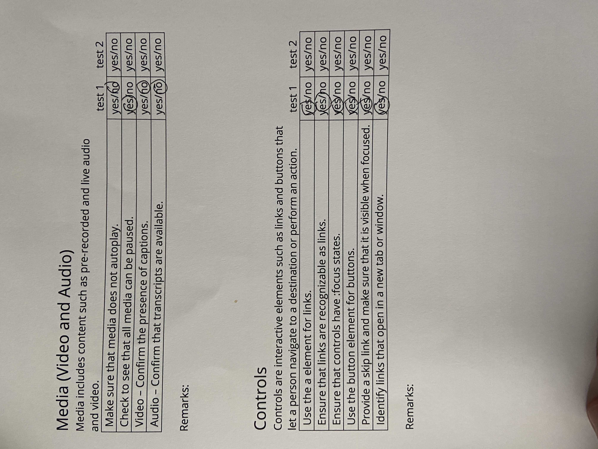
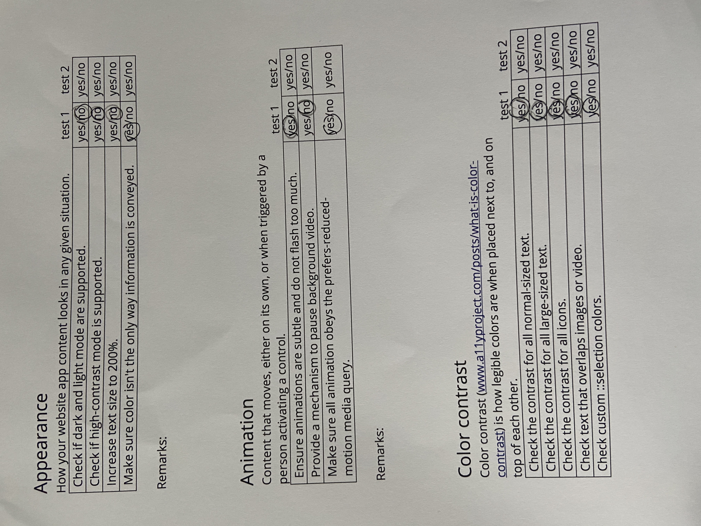

# Procesverslag
Markdown is een simpele manier om HTML te schrijven.  
Markdown cheat cheet: [Hulp bij het schrijven van Markdown](https://github.com/adam-p/markdown-here/wiki/Markdown-Cheatsheet).

Nb. De standaardstructuur en de spartaanse opmaak van de README.md zijn helemaal prima. Het gaat om de inhoud van je procesverslag. Besteedt de tijd voor pracht en praal aan je website.

Nb. Door *open* toe te voegen aan een *details* element kun je deze standaard open zetten. Fijn om dat steeds voor de relevante stuk(ken) te doen.

## Jij

  
uitwerken voor kick-off werkgroep

  ### Auteur:
  Kim Karanko

  #### Je startniveau:
  Blauw

  #### Je focus:
  Responsive
 

## Je website

  
uitwerken voor kick-off werkgroep

  ### Je opdracht:
  (https://www.nike.com/gb/membership)](https://www.nike.com/nl/)

  #### Screenshot(s) van de eerste pagina (small screen): 
  Home Page 
  

  #### Screenshot(s) van de tweede pagina (small screen):
  Membership Page
  
 

## Toegankelijkheidstest 1/2 (week 1)

  
uitwerken na test in 2e werkgroep

  
  
  
  
  

## Breakdownschets (week 1)

  
uitwerken na afloop 3e werkgroep

  ### de hele pagina: 
  ### dynamisch deel Pagina 1: 
  

  ### dynamisch deel Pagina 2 
  

  ### wellicht nog een dynamisch deel (bijv filter): 
  

## Voortgang 1 (week 2) (afwezig)

  
uitwerken voor 1e voortgang

  ### Stand van zaken
  -

  ### Agenda voor meeting
  samen met je groepje opstellen
  -

  ### Verslag van meeting
  -

## Voortgang 2 (week 3)

  
uitwerken voor 2e voortgang

  ### Stand van zaken
  Het ging voor mijn gevoel goed tot dit gesprek, het enige waar ik mee zat was ik mijn site niet live kreeg via visual studio code.

  ### Agenda voor meeting
  -

  ### Verslag van meeting
  Het live krijgen van mijn code was snel opgelost met de studentenassistent, kreeg ook te horen dat mijn code er goed uit zag.

## Toegankelijkheidstest 2/2 (week 4)

  
uitwerken na test in 9e werkgroep

  
  
  

  ### Bevindingen
  -

## Voortgang 3 (week 4)

  
uitwerken voor 3e voortgang

  ### Stand van zaken
  Tot dit punt ging het redelijk goed, de eerste html page was zo goed als af. Ik wist dat ik de laatste weekend hard moest werken om     de tweede html page ook af te krijgen. 

  ### Agenda voor meeting

  ### Verslag van meeting
  Ik had deze week met studentenassistent Thije gesproken. Hij vertelde mij dat ik nog te veel div's had gebruikt, mijn code moest        meer semantisch worden. Voor het eind gesprek heb ik veel div's weggehaald en vervangen door semantische code zoals bijvoorbeeld        sections.

## Eindgesprek (week 5)

  
uitwerken voor eindgesprek

  ### Je uitkomst - karakteristiek screenshots:
  

  ### Dit ging goed/Heb ik geleerd: 
  Ik ben trots op hoe het eruit ziet, mijn zus dacht  bijvoorbeeld dat ik op de echte Nike site aan het kijken was. Aan het begin had ik er al weinig vertrouwen in omdat programmeren niet mijn sterkste punt is. Ik heb rustig de tijd genomen en mijn best gedaan, uiteindelijk vind ik dat het een mooie site geworden. Wat ik heb geleerd is dat chatGPT handig is voor het debuggen van code. Vooral aan het einde van van het bouwen van de site kwamen er veel bugs tevoorschijn, vooral bij javascript. Dit is gelukkig opgelost door het gebruik van chatGPT. 

  

  ### Dit was lastig/Is niet gelukt:
  Wat het lastigste was, was het laten werken van de javascript. Hier heb ik het meeste tijd in zitten, ik kreeg bij het begin ook spijt van dat ik responsive had uitgekozen omdat dat erg lastig was om te doen. Gelukkig werkt alles nu wel goed. Wat jammer was, was dat ik erg laat er achter kwam dat het gebruiken van te veel div's niet helemaal de bedoeling was. De div's heb ik nog geprobeerd te verminderen in de laatste dagen. 

  

## Bronnenlijst

  
continu bijhouden terwijl je werkt

  Nb. Wees specifiek ('css-tricks' als bron is bijv. niet specifiek genoeg). 
  Nb. ChatGpT en andere AI horen er ook bij.
  Nb. Vermeld de bronnen ook in je code.

  1. https://www.w3schools.com/howto/howto_js_accordion.asp - accordion 
  2. https://www.w3schools.com/howto/howto_css_next_prev.asp - next and previous buttons
  3. https://www.w3schools.com/howto/howto_css_hero_image.asp - hero image
  4. https://www.w3schools.com/howto/howto_js_slideshow.asp - carousel
  5. https://www.w3schools.com/cssref/css3_pr_text-shadow.php - font shadow
  6. https://www.w3schools.com/howto/howto_css_searchbar.asp - search bar
  7. https://chat.openai.com - responsive maken
  8. https://chat.openai.com - veel gebruikt voor het oplossen van errors

